# Debugging Ember via Flowchart


---

# [fit]Assumptions can be expensive

- What do I think should happen?
- What is actually happening?
- Is what I think should happen incorrect?

---

# The companion to this talk

`https://www.mutuallyhuman.com/blog/2016/08/12/an-ember-debugging-flowchart`

---

## Three kinds of errors

1. Seeing the wrong thing
1. Javascript errors
1. OMG Ember Data

---

# Seeing the wrong thing
1. Part of the page is wrong
2. Part of the page is *gone*
3. The **whole** page is gone

---

## Our Good Friend Handlebars

- Source of truth
- Static and {{dynamic}} content

---

## Spelling mistakes are $$

```hbs
<span class="position-count">
  There are {{positinos.length}} positions
</span>
```

---

# Where do *Mustaches* come from?

---

## Rendering contexts

- Controller
- Component
- Partial

---
# A Computed Property

```hbs
{{! my-component.hbs }}
<span>
  Hi my name is {{fullName}}!
</span>
```

```javascript
//my-component.js
import Ember from 'ember';
let { computed } = Ember;
export default Ember.Component.extend({
  fullName: computed('first', 'last', function() {
    return `${this.get('first')} ${this.get('last')}`;  
  })
})
```

---

# Dependent Keys

## Does it (re)compute?

- **Values:** `1`, `"Hi"`
- **References:** `{name: "Bob"}`, `[1, 2, 3]`
- `foo`, `foo.[]`, `foo.@each.bar`

```js
name: computed('user', function() {}),
init() {
  //doesn't cause name to recompute
  this.set('user.name', 'foo');
}
```


---

## Promises and CPs

Async relationships **always** return a reference to a *Proxy*.

```js
posts: DS.hasMany('post'),
user: DS.belongsTo('user'),

init() {
  this.get('posts').toString(); // "<DS.PromiseManyArray:ember1990>"
  this.get('user').toString(); // "<DS.PromiseObject:ember3557>"
  
  this.get('user.name') // undefined before promise resolves
  this.get('user').then(() => {
    this.get('user.name') // "Steve" after promise resolves
  }) 
}
```

---

# Where do the values come from?

## Wash, rinse, repeat

---

# A Bound Property

```hbs
{{! my-component.hbs }}
<span>
  Hi my name is {{name}}!
</span>
```

```javascript
//my-component.js
import Ember from 'ember';
export default Ember.Component.extend({
  name: 'default'
})
```

---

# Where is it set - js

- Component or Route Lifecycle hooks
- Actions
- Observers

---

```javascript
//from inside the rendering context
init() {
  this._super(...arguments);
  this.set('name', 'New Name');
}

//from somewhere else
setupController(controller, model) {
  this._super(...arguments);
  controller.set('name', 'Suprise!'))
}
```

---

# Did the setter get called?

## When you thought it would?
## With the value you intended?


---

# Validate assumptions with breakpoints

---

# Where is it set - hbs

```hbs
{{! invocation }}
{{my-component name="Kyle"}}

{{! helper }}
{{my-component name=(fancy-name name)}}

{{! two-way binding }}
{{my-component name=boundName}}
{{input value=boundName}}
```

---

## Finding where a value changed

```js
Ember.Component.extend({
  heisenValue: "foo",

  forDebug: Ember.observer('heisenValue', function() {
    debugger;
  })
});
```

---

# I See Nothing

```javascript
App = Ember.Application.extend({
  LOG_TRANSITIONS_INTERNAL: true // THIS
});
```

- Are the routes resolving correctly?
- Are network requests successful?

---

# Javascript errors

---

# Stacktraces

- Check EmberError.stack
- Use breakpoints to set breakpoints

---
# The Error stack
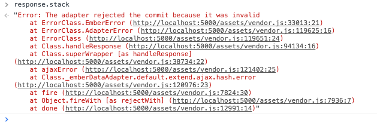

---
# Network requests

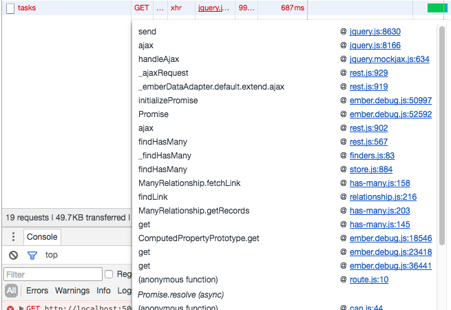

- Chrome is your master now

---
# Backburner

```javascript
Ember.run.backburner.DEBUG = true;
App = Ember.Application.extend({
});
```
* Go up the stack to `invokeWithError`

---
# Ember Data

- Start at the network request
- End at the store
- Async relationships are promises

---

# Me !== Ember

What I think should happen is not what Ember thinks

---

# Learn

- The Ember Guides
- Api Docs
- Source Code
- Tests
- Ember Slack

---
# Tests - An Illustrated Example

---

test code -> route -> store -> ajax -> controller -> component

**This is why acceptance tests get complicated**

---
# I see nothing
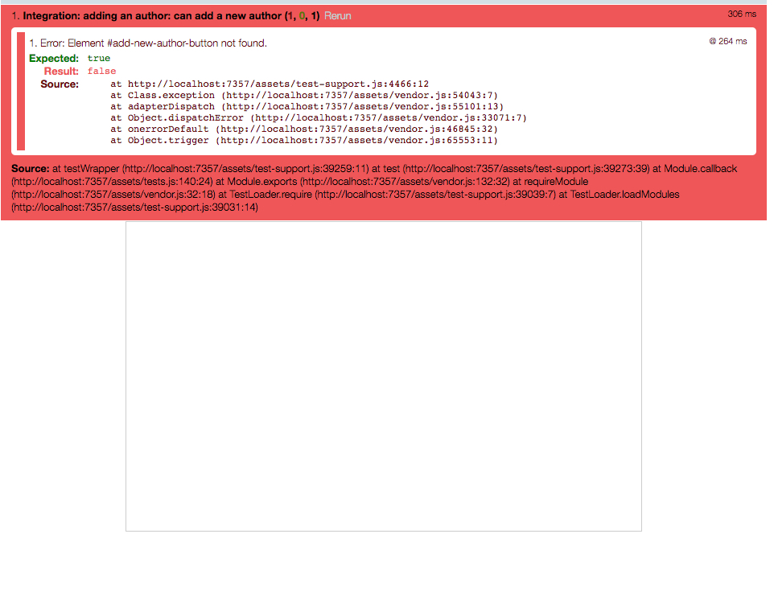

---
# Check routing
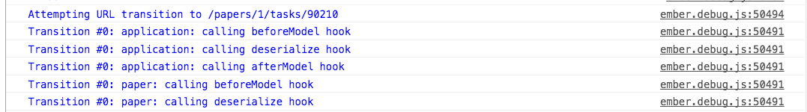

---
# Router Error Action
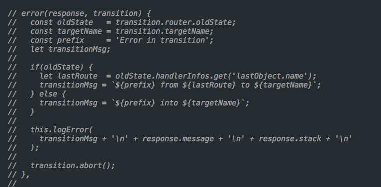

---
# Breakpoints for Breakpoints
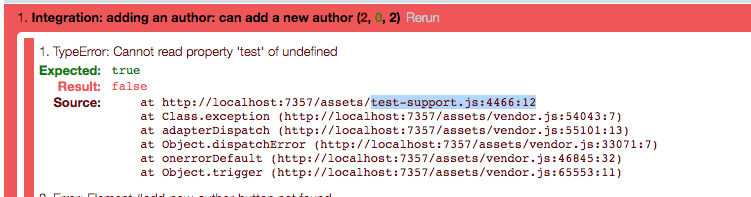

---
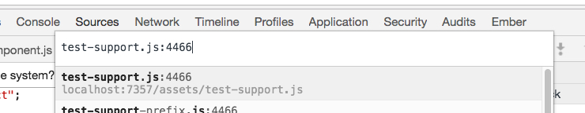

---
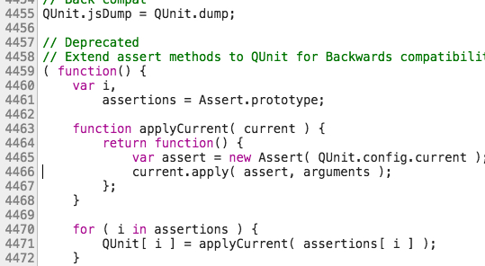

---


---
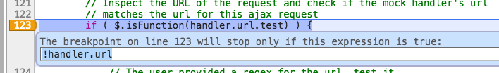

---
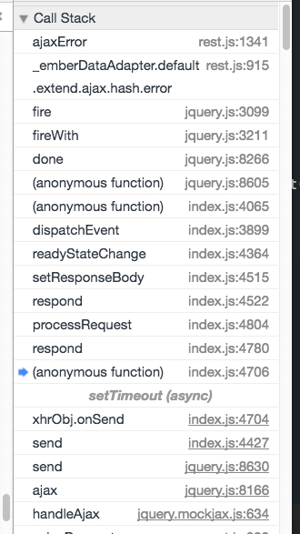

---
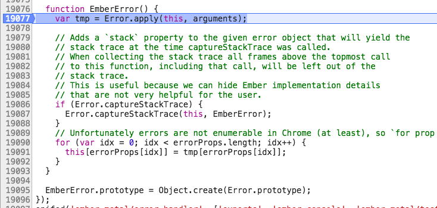

---
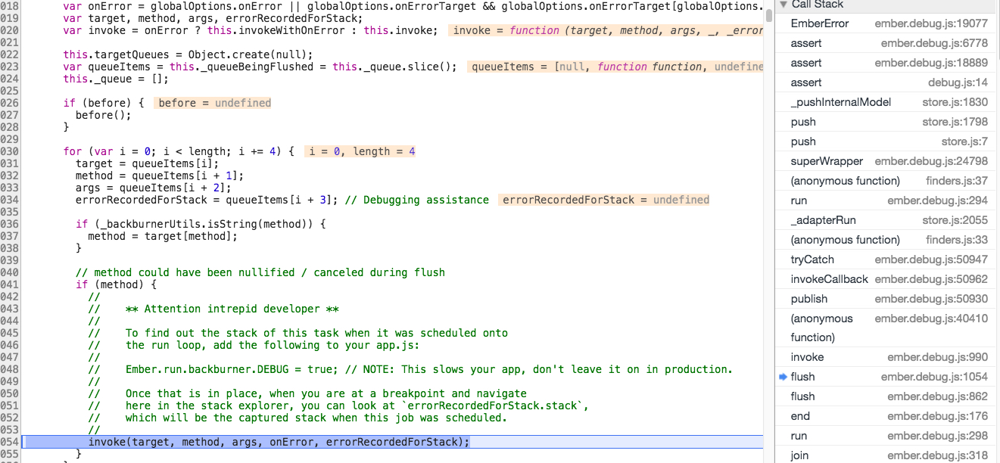

---
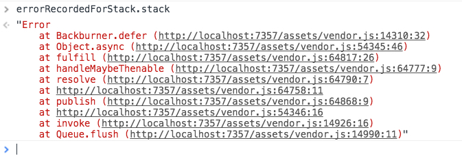

---
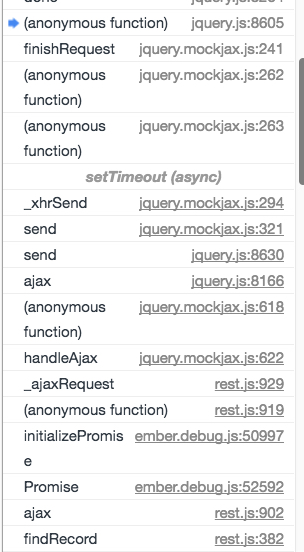

---
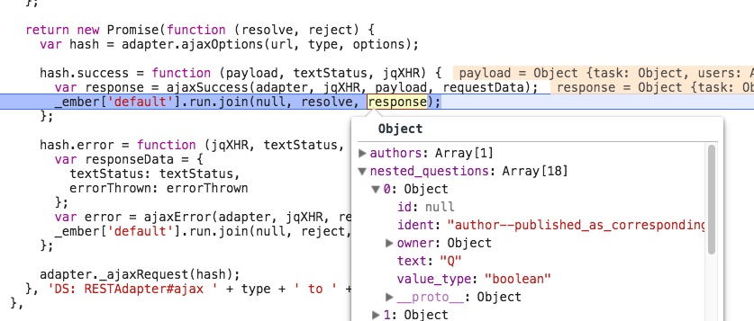

---
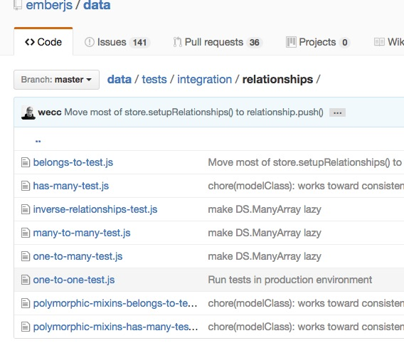

---


 
 
