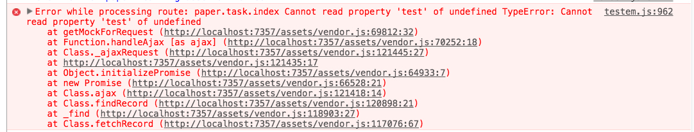

# Debugging Ember via Flowchart


---

# [fit]Assumptions can be expensive

- What do I think should happen?
- What is actually happening?
- Is what I think should happen incorrect?

---

## Spelling mistakes are $$

```hbs
<span class="position-count">
  There are {{positinos.length}} positions
</span>
```

---

# The companion to this talk

`https://www.mutuallyhuman.com/blog/2016/08/12/an-ember-debugging-flowchart`

---

## Assumptions to address

- My application's state
- My code's behavior
- Ember's behavior

---

## A few kinds of errors

1. The page content is wrong
1. Javascript errors
1. OMG Ember Data

---

# Seeing the wrong thing
1. Part of the page is wrong
2. Part of the page is *gone*
3. The **whole** page is gone

---

## Our Good Friend Handlebars

- Source of truth
- Static and {{dynamic}} content

---

## Our Good Friend Handlebars

```hbs
<span>
  Nothing can go wrong here!
  {{allYourProblems}}
</span>
```

---

# What makes a good {{mustache}} go bad?

---

# A Bound Property

```hbs
{{! templates/components/my-component.hbs }}
<span>
  Hi my name is {{fullName}}!
</span>
```

```javascript
// components/my-component.js
export default Ember.Component.extend({
  fullName: "Steve"
})
```
---

## Rendering contexts

- template -> context
- `templates/foo.hbs` -> `controllers/js.hbs`
- `templates/components/bar.hbs` -> `components/bar.js`
- `templates/partials/p.hbs` -> ?

---

## Rendering contexts

The context needs to have the property set somehow.

- Prototype
- Superclass/Mixin
- `Ember.set()`
- Component invocation
- Two-way binding

---

## Prototype

```javascript
// components/my-component.js
export default Ember.Component.extend({
  fullName: "Steve"
})
```
---

## Superclass

```javascript
// components/my-component.js
let Named = Ember.Component.extend({
  firstName: null
});

export default Named.extend({
  lastName: "Steve"
  // template will also have acces to firstName
})
```
---

## Mixin

```javascript
// components/my-component.js
let Named = Ember.Mixin.create({
  firstName: null
});

export default Ember.Component.extend(Named, {
  lastName: "Steve"
  // template will also have acces to firstName
})
```

---

# Ember.set()

- Component or Route Lifecycle hooks
- Actions
- Observers

---

```javascript
//from inside the rendering context
init() {
  this._super(...arguments);
  this.set('name', 'New Name');
}

//from somewhere else
setupController(controller, model) {
  this._super(...arguments);
  controller.set('name', 'Suprise!'))
}
```

---

# Did the setter get called?

## When you thought it would?
## With the value you intended?

---

# Where is it set - hbs

```hbs
{{! invocation }}
{{my-component name="Kyle"}}

{{! helper }}
{{my-component name=(fancy-name name)}}

{{! two-way binding }}
{{my-component name=boundName}}
{{input value=boundName}}
```

---

# A Computed Property

```hbs
{{! my-component.hbs }}
<span>
  Hi my name is {{fullName}}!
</span>
```

```javascript
//my-component.js
import Ember from 'ember';
let { computed } = Ember;
export default Ember.Component.extend({
  fullName: computed('first', 'last', function() {
    return `${this.get('first')} ${this.get('last')}`;  
  })
})
```

---

# Dependent Keys

```javascript
Ember.computed('foo', function() { return this.get('foo') })
//              ^----dependent key
```

If the initial value is correct, but the property doesn't recalculate,
the property's dependent keys are probably not correct

---

# Computed Properties are Lazy

---

## CPs are Lazy

```javascript
{
  name: "Chris",
  hello: Ember.computed(
    function() { return "Hello " + this.get('name'); })
}
//-----------------
this.get('hello') // "Hello Chris"
this.set('name', 'Fran'); 
this.get('hello') // "Hello Chris"
```

---

## CPs and Objects

```javascript
{
  user: {name: "Chris"},
  hello: Ember.computed('user', function() {
  return "Hello " + this.get('user.name'); })
}
//-----------------
this.get('hello') // "Hello Chris"
this.set('user.name', 'Fran');
this.get('hello') // "Hello Chris"

this.set('user', {name: "Mike"});
this.get('hello') // "Hello Mike"
```
---

## When to recompute?

```javascript
Ember.computed('user', function() {})

user: 'Mike' // recompute when value of 'user' changes
user: 12 // recompute when value of 'user' changes
user: {name: 'Mike'} //recompute when 'user' is replaced completely
user: ['Mike'] //recompute when 'user' is replaced completely
```

- Strings & Number = Values
- Objects & Arrays = References
- Mutating objects & arrays does not bust CP cache!

---

## CPs and Objects

```javascript
Ember.computed(
  'user', //busts cache if 'user' object is replaced
  'user.name', //busts cach if 'user' object is replaced
               //or if 'user.name' value changes
  function() {})
```

- Strings & Number = Values
- Objects & Arrays = References

---

## CPs and Arrays

1. `'foo'` Change if ref to array is changes
1. `'foo.[]'` Change if length of array changes *plus* #1
1. `'foo.@each.bar'` Change if any object in array's 'bar' prop changes *plus* #1 & #2

```js
name: computed('foo', 'foo.[]', 'foo.@each.bar',
//              ^------^---------redundant
               function() {}),
```

---

## Aside - Promises and CPs

Async relationships **always** return a reference to a *Proxy*.

```js
posts: DS.hasMany('post'),
user: DS.belongsTo('user'),

init() {
  this.get('posts').toString(); // "<DS.PromiseManyArray:ember1990>"
  this.get('user').toString(); // "<DS.PromiseObject:ember3557>"

  this.get('user.name') // undefined before promise resolves
  this.get('user').then(() => {
    this.get('user.name') // "Steve" after promise resolves
  }) 
}
```

---

# Where do the values come from?

## Wash, rinse, repeat

---

# Validate assumptions with breakpoints

---

## Finding where a value changed

```js
Ember.Component.extend({
  heisenValue: "foo",

  forDebug: Ember.observer('heisenValue', function() {
    debugger;
  })
});
```

---

# I See Nothing

```javascript
App = Ember.Application.extend({
  LOG_TRANSITIONS_INTERNAL: true // THIS
});
```

- Are the routes resolving correctly?
- Are network requests successful?

---

# Javascript errors

---

# Stacktraces

- Check EmberError.stack
- Use breakpoints to set breakpoints

---
# The Error stack


---
# Network requests


---
# Backburner

```javascript
Ember.run.backburner.DEBUG = true;
App = Ember.Application.extend({
});
```
* Go up the stack to `invokeWithError`

---
# Ember Data

- Start at the network request
- End at the store
- Async relationships are promises

---

# Me !== Ember

What I think should happen is not what Ember thinks

---

# Learn

- The Ember Guides
- Api Docs
- Source Code
- Tests
- Ember Slack

---
# Tests - An Illustrated Example

---

test code -> route -> store -> ajax -> controller -> component

**This is why acceptance tests get complicated**

---
# I see nothing


---
# Check routing


---
# Breakpoints for Breakpoints


---


---


---


---


---


---


---


---


---


---


---


---


 
 
